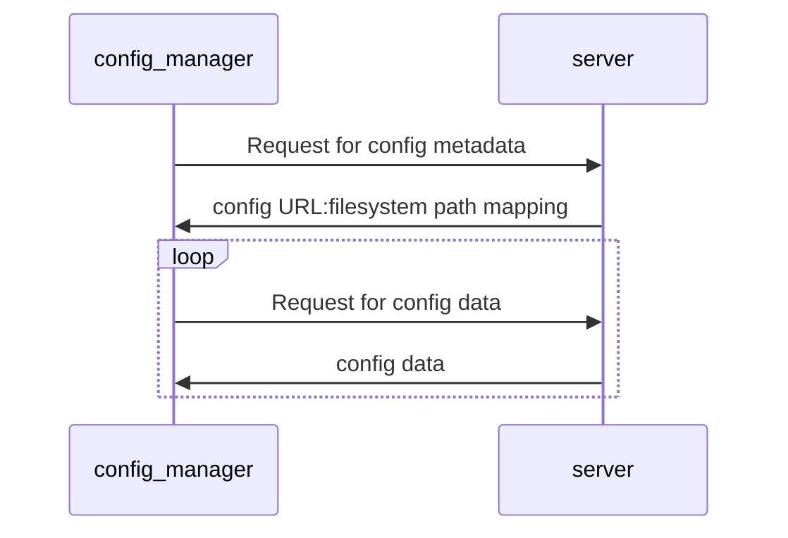

# config_manager
Small program to manage config files

## Flowchart

```mermaid
sequenceDiagram
    config_manager->>server: Request for config metadata
    server->>config_manager: config URL:filesystem path mapping
    loop
        config_manager->>server: Request for config data
        server->>config_manager: config data
    end
```
